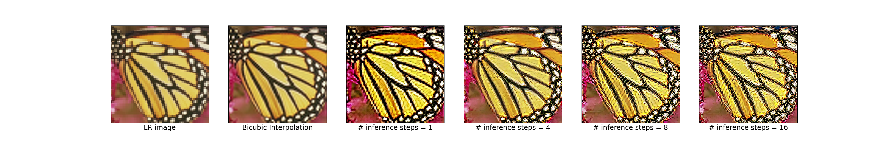
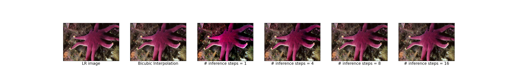
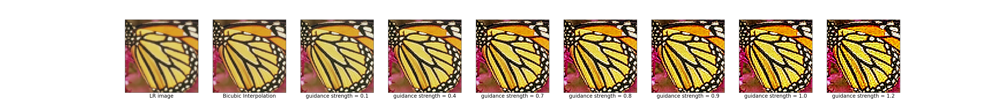
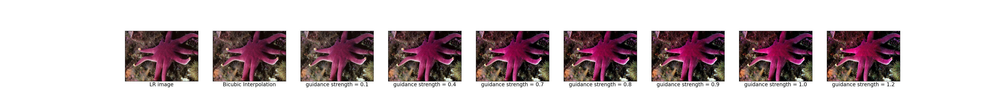
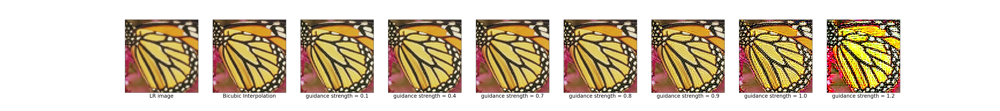
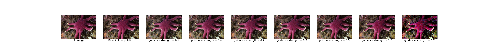

### Reimplementing DDNM based image super-resolution with SD3.5
This repo is a **reimplementation of [DDNM (Denoising Diffusion Null-space Model)](https://arxiv.org/pdf/2212.00490)** adapted for the **Stable Diffusion 3 / 3.5 flow matching objective**.  
The goal is to obtain **training-free super-resolution** in the **latent space** with stable diffusion 3.5 generative prior.

In the paper, a DDPM/DDIM pixel space diffusion model is used to iteratively refine the predicted clean image $x_{0|t}$ at every step $t$ as follows [Equation $(13)$ in the paper]
$$
x_{0|t} = A^{\dagger}y + (I - A^{\dagger}A)x_{0|t}
$$
where $A \in \mathbb{R}^{d \times D}, y \in \mathbb{R}^{d \times 1}$ are the linear degradation operator and the degraded input image respectively.
For super-resolution, $y$ corresponds to the low resolution (LR) input image. The linear degradation operation is chosen to be bicubic interpolation, similar to the original implementation.  

For latent space diffusion models with vae encoder $g$ and vae decoder $g'$, the above equation can easily be extended as follows
$$
x_{0|t} = g(A^{\dagger}y) + (x_{0|t} - g(A^{\dagger}Ag'(x_{0|t})))   \tag{1}
$$
where $A$ is a linear degradation operator in the pixel space.

The original paper improves the above and introduces DDNM+ to correct for the excess noise in the diffusion steps, by modulating the noise magnitude to align with the expected diffusion schedule.
Since noise is not added during sampling under the flow matching objective, modulating noise may not be needed.
But, from the experiments, $Eq (2)$ results in oversaturated images. 
To improve the results, modulating the strength of the null-space projection as follows
$$
x_{0|t} = g(A^{\dagger}y) + \lambda(x_{0|t} - g(A^{\dagger}Ag'(x_{0|t})))   \tag{2}
$$
where $\lambda \in [0,1]$. $\lambda=0$ would output the bicubic intrpolation image as is. 
$\lambda > 1$ will result in noisy and oversaturated image.

### Results
Following are examples of varying the number of inference steps with $\lambda=1$ for $4 \times$ upsampling.
Bicubic interpolation is smooth and blurs high-frequency details as expected.

Further, results from varying $\lambda$ with #inference step = 1 for $4 \times$ upsampling are as follows. 
$\lambda \in [0.7, 0.9]$ avoids oversaturation and chroma noise.

Similar results are observed on varying $\lambda$ with #inference step = 8 for $4 \times$ upsampling as follows

### Run training-free super-resolution 
    pip install -r requirements.txt
    python3 main.py --hf_token <hf_token> 
                    --lr_img_path <lr_img_path> 
                    --num_inference_steps <steps> 
                    --guidance_strength <strength> 
                    --scale <scale>
                    --savepath <savepath>

### References
- [Zero-Shot Image Restoration Using Denoising Diffusion Null-Space Model](https://arxiv.org/pdf/2212.00490)
- [DDNM github](https://github.com/wyhuai/DDNM)
- [Stable Diffusion 3.5](https://huggingface.co/stabilityai/stable-diffusion-3.5-large)